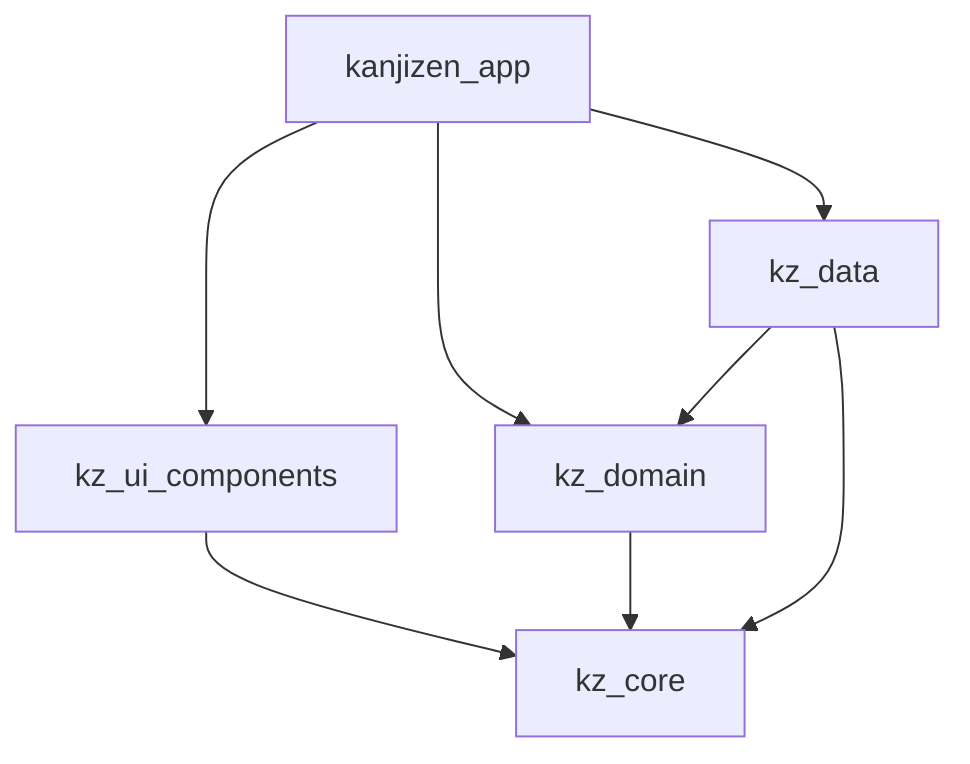

# KanjiZen ⛩️

> **Cognitive Overdrive. Zero Latency. Pure Muscle Memory.**
> High-intensity cognitive conditioning designed to obliterate the translation latency between the Western brain and native Japanese writing.

```
       _  __                 _ ______
      | |/ /                (_)___  /
      | ' /  __ _ _ __   _  _ _  / /  ___ _ __
      |  <  / _` | '_ \ | | | | | / /  / _ \ '_ \
      | . \| (_| | | | || |_| | |/ /__|  __/ | | |
      |_|\_\\__,_|_| |_| \__, |_/_____|\___|_| |_|
                          __/ |
                         |___/
```

[](https://flutter.dev)
[](https://dart.dev)
[](https://melos.invertase.dev)
[](https://isar.dev)
[](.github/workflows/ci.yml)

---

## ⚡ The Manifesto

KanjiZen is not a gamified language app. There are no friendly owl mascots to give you a pat on the back, and no slow-paced exercises to help you pass the time. It is an **extreme cognitive conditioning environment** engineered to force native visual reflexes.

### 🛡️ Core Pillars

| Pillar | Philosophy | Engineering Translation |
|---|---|---|
| **Anti-Traditional Pedagogy** | We reject analytical translation. Thinking is latency. We condition your brain to bypass the intermediate Western concept and link the Japanese character directly to the neurological representation of the object. | High-speed tactile flick layouts, vector path tracing validation, and active recall engines. |
| **Gold Standard: Reaction Ms** | Knowing a Kanji does not mean drawing it after staring at it for ten seconds. If you cannot evoke its meaning, reading, or strokes within the pressure of the **Death Clock (0.5s - 3.0s)**, you do not know it. | Millisecond-level latency tracking per character, calculating adaptive SRS weights based on performance. |
| **Local-First Architecture** | Network calls are slow. Relying on remote servers for core training loops is unacceptable. The entire semantic payload of **KANJIDIC2** and path coordinates of **KanjiVG** are compiled and persisted locally. | Embedded Isar NoSQL engine running concurrent background isolates for zero UI frame drops. |
| **Kinesthetic Integration** | Spatial recognition is directly coupled with muscle memory. Real Japanese input methods (Flick keyboard) and stroke order geometries must become automatic reflexes. | Custom vector paint paths checked against mathematical deviation thresholds in real time. |

---

## 🏗️ Monorepo Architecture (Melos & Clean DDD)

KanjiZen is structured as an enterprise-grade monorepo managed with Melos. Responsibilities are strictly segregated into independent packages to ensure absolute Clean Architecture boundaries:

```
KanjiZen/ (Monorepo Root)
├── apps/
│   └── kanjizen_app/          # Core Flutter Application
│       ├── lib/src/features/  # Presentation Screens (Home, Matrix, Profile...)
│       ├── lib/src/providers/ # State Controllers (Timeline, Game, Campaign)
│       └── assets/data/       # Compiled KANJIDIC2/KanjiVG seed datasets
├── packages/
│   ├── kz_core/               # Architecture Core (Base interfaces, CyberTheme, failures)
│   ├── kz_data/               # Data Infrastructure (Isar local DB schema, repository impl)
│   ├── kz_domain/             # Pure Domain Rules (SRS evaluator, typist matching, settings)
│   └── kz_ui_components/      # Cyberpunk UI Design System (Atoms, custom vector painters)
└── tools/
    └── mason/                 # Local code generator templates (bricks)
```

### Dependency Segregation Matrix



*   [kanjizen_app](apps/kanjizen_app): Entry points, routing (GoRouter), state orchestration (Riverpod), and terminal view layers.
*   [kz_ui_components](packages/kz_ui_components): Atomic widgets (`RayitaInput`, custom glassmorphic panels) and vector painters rendering stroke paths at a raw OpenGL/Impeller level.
*   [kz_domain](packages/kz_domain): Pure Dart layer containing business rules. Agnostic of Flutter, database schemas, or frameworks.
*   [kz_data](packages/kz_data): Low-level persistence operations. Local database initializers, seeding scripts, and data serialization.
*   [kz_core](packages/kz_core): Base theme constants, global exceptions, and agnostic abstract contracts.

---

## 🛠️ The Multimodal Arsenal

The main core selector hosts independent cognitive engines designed to attack different neural pathways:

| Engine | Route | Purpose |
|---|---|---|
| **MECA** | `/home` | Typing engine: infinite Kana/Kanji input with Death Clock. |
| **KANJI** | `/home` | Progressive scaffolding: exposure → active recall of readings. |
| **QUIZ** | `/home` | Fine discrimination matrix with radical-based distractors. |
| **ARCADE** | `/home` | Kinetic survival: drag-and-drop falling concepts. |
| **WRITE** | `/home` | Stroke validation against KanjiVG vector paths. |
| **Kana Levels** | `/home/kanas` | Structured campaign map for Hiragana/Katakana. |
| **Kanji Levels** | `/home/kanjis` | Structured campaign map for Kanji acquisition. |
| **Inventory** | `/home/inventory` | Dense grid of all unlocked/locked characters. |

---

## 🧱 Architecture Rules (Post-Refactor v2.0)

The following rules are non-negotiable and enforced by code review:

1. **Zero Cross-Talk Between Engines**
   - `TimelineNotifier.setEngineMode` resets timers, clears active campaigns, and zeroes session metrics (`streak`, `avgMs`, `hitRate`, `lives`).
   - The frozen-node feed is capped at `50` items to prevent zombie widget accumulation.
   - `DynamicTerminalBar` clears local input buffers synchronously on node/mode change.

2. **Elastic Layouts Only**
   - No static `width`/`height` in main containers, dialogs, or menus.
   - Use `LayoutBuilder`, `Expanded`, `Flexible`, `Wrap`, `FittedBox`, and `MediaQuery` proportions.
   - Keyboard-aware screens use `resizeToAvoidBottomInset: true` and scrollable content.

3. **Responsive Dense Grids**
   - `SliverGridDelegateWithMaxCrossAxisExtent` replaces fixed `crossAxisCount`.
   - Locked cells always show the glyph dimmed + a `16×16` corner lock icon. The glyph is never hidden by the lock.

4. **Synchronous Input Buffer Cleanup**
   - `RayitaInput` is a pure visual atom; it never clears its own controller.
   - `DynamicTerminalBar` owns the controller/focus and purges text instantly on `success`/`error`.
   - `VirtualFlickKeyboard` includes backspace and respects `enabled` states.

---

## 💾 Compact Persistence Layout

To achieve zero UI overhead, KanjiZen avoids heavy SQLite/Isar relational joins. Attempt history is stored inside a highly compacted bitfield array (`historyBlob`):

```
┌─────────────────┬─────────────────┬──────────────────────────────────┐
│  Bit 15 (bool)  │  Bit 14 (bool)  │       Bits 13 - 0 (uint14)       │
├─────────────────┼─────────────────┼──────────────────────────────────┤
│    isCorrect    │ isDoubleStroke  │            responseMs            │
└─────────────────┴─────────────────┴──────────────────────────────────┘
```

The `TierCalculator` computes the character's mastery tier using this binary logs array. A response latency of `> 16383ms` is automatically clamped to prevent bit overflows, ensuring statistics remain lightweight and consistent.

---

## 🚀 Setup & Execution

### Prerequisites

*   Flutter SDK `≥ 3.32.5`
*   Dart SDK `≥ 3.8.1`
*   Android SDK + a device or emulator (for mobile execution)
*   [Melos](https://melos.invertase.dev) activated globally:
    ```bash
    dart pub global activate melos
    ```
*   [Mason CLI](https://github.com/felangel/mason) activated globally (optional, for code generator bricks):
    ```bash
    dart pub global activate mason_cli
    ```

### Bootstrapping Workspace

```bash
# Clone the repository
git clone https://github.com/calinrus-dev/KanjiZen.git
cd KanjiZen

# Install and link all internal packages
melos bootstrap

# Execute mass code generation (Freezed, Riverpod, Isar)
melos run build_runner
```

### Developer Scripts

All standard lifecycle tasks are wrapped in Melos workspace commands:

| Command | Action |
|---|---|
| `melos run pub:get` | Installs dependencies across all packages. |
| `melos run lint` | Runs format checks and static analysis globally. |
| `melos run test` | Executes unit and widget tests on all modules. |
| `melos run clean` | Runs clean processes for all packages. |
| `melos run build_runner:clean` | Cleans build runner build caches. |
| `melos run build_runner:watch` | Starts code generation in watch mode. |
| `melos run mason:get` | Downloads dependencies for local bricks. |
| `melos run mason:make` | Generates a new Clean Architecture feature directory. |

### Run on a Physical Device

1. Enable **USB debugging** on your Android phone.
2. Connect it via USB and authorize the computer.
3. Verify detection:
   ```bash
   flutter devices
   ```
4. Run the app:
   ```bash
   cd apps/kanjizen_app
   flutter run
   ```
   Or target a specific device:
   ```bash
   flutter run -d <device-id>
   ```

For release builds:
```bash
cd apps/kanjizen_app
flutter run --release
```

---

## 🧱 Code Generation with Mason

This repo ships local Mason bricks under `tools/mason/`.

```bash
# From repo root
cd tools/mason
mason get
mason make feature_brick
```

Available bricks:

| Brick | Generates |
|---|---|
| `feature_brick` | Full feature folder: `domain/`, `providers/`, `presentation/`, `widgets/`. |
| `widget_brick`  | A single Cyber-Zen responsive widget with `LayoutBuilder`. |
| `provider_brick`| A Riverpod `@riverpod` notifier with reset/dispose boilerplate. |

---

## ✅ Verified State

- `flutter analyze` → **No issues found**
- `melos run test` → **All tests passed**
- Target device tested: Realme RMX5010 (Android 15, Impeller/Vulkan)

---

*Zero BS. Zero Latency. Native Reflex.*
