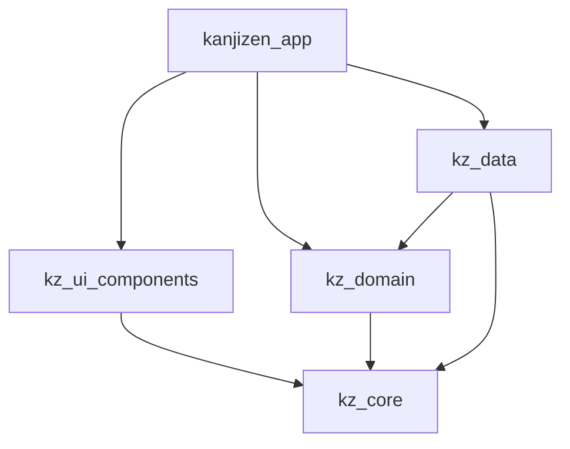

# KanjiZen ⛩️

> **Cognitive Overdrive. Zero Latency. Pure Muscle Memory.**
> High-intensity cognitive conditioning designed to obliterate the translation latency between the Western brain and native Japanese writing.

```
       _  __                 _ ______
      | |/ /                (_)___  /
      | ' /  __ _ _ __   _  _ _  / /  ___ _ __
      |  <  / _` | '_ \ | | | | | / /  / _ \ '_ \
      | . \| (_| | | | || |_| | |/ /__|  __/ | | |
      |_|\_\\__,_|_| |_| \__, |_/_____|\___|_| |_|
                          __/ |
                         |___/
```

[](https://flutter.dev)
[](https://dart.dev)
[](https://melos.invertase.dev)
[](https://isar.dev)
[](https://github.com/calinrus-dev/KanjiZen)

---

## ⚡ The Manifesto

KanjiZen is not a gamified language app. There are no friendly owl mascots to give you a pat on the back, and no slow-paced exercises to help you pass the time. It is an **extreme cognitive conditioning environment** engineered to force native visual reflexes.

### 🛡️ Core Pillars

| Pillar | Philosophy | Engineering Translation |
|---|---|---|
| **Anti-Traditional Pedagogy** | We reject analytical translation. Thinking is latency. We condition your brain to bypass the intermediate Western concept and link the Japanese character directly to the neurological representation of the object. | High-speed tactile flick layouts, vector path tracing validation, and active recall engines. |
| **Gold Standard: Reaction Ms** | Knowing a Kanji does not mean drawing it after staring at it for ten seconds. If you cannot evoke its meaning, reading, or strokes within the pressure of the **Death Clock (0.5s - 3.0s)**, you do not know it. | Millisecond-level latency tracking per character, calculating adaptive SRS weights based on performance. |
| **Local-First Architecture** | Network calls are slow. Relying on remote servers for core training loops is unacceptable. The entire semantic payload of **KANJIDIC2** and path coordinates of **KanjiVG** are compiled and persisted locally. | Embedded Isar NoSQL engine running concurrent background isolates for zero UI frame drops. |
| **Kinesthetic Integration** | Spatial recognition is directly coupled with muscle memory. Real Japanese input methods (Flick keyboard) and stroke order geometries must become automatic reflexes. | Custom vector paint paths checked against mathematical deviation thresholds in real time. |

---

## 🏗️ Monorepo Architecture (Melos & Clean DDD)

KanjiZen is structured as an enterprise-grade monorepo managed with Melos. Responsibilities are strictly segregated into independent packages to ensure absolute Clean Architecture boundaries:

```
KanjiZen/ (Monorepo Root)
├── apps/
│   └── kanjizen_app/          # Core Flutter Application
│       ├── lib/src/features/  # Presentation Screens (Home, Matrix, Profile...)
│       ├── lib/src/providers/ # State Controllers (Timeline, Game, Campaign)
│       └── assets/data/       # Compiled KANJIDIC2/KanjiVG seed datasets
├── packages/
│   ├── kz_core/               # Architecture Core (Base interfaces, CyberTheme, failures)
│   ├── kz_data/               # Data Infrastructure (Isar local DB schema, repository impl)
│   ├── kz_domain/             # Pure Domain Rules (SRS evaluator, typist matching, settings)
│   └── kz_ui_components/      # Cyberpunk UI Design System (Atoms, custom vector painters)
└── tools/
    └── mason/                 # Local code generator templates (bricks)
```

### Dependency Segregation Matrix



*   [kanjizen_app](file:///c:/Users/calin/Desktop/KanjiZen/apps/kanjizen_app): Entry points, routing (GoRouter), state orchestration (Riverpod), and terminal view layers.
*   [kz_ui_components](file:///c:/Users/calin/Desktop/KanjiZen/packages/kz_ui_components): Atomic widgets (`RayitaInput`, custom glassmorphic panels) and vector painters rendering stroke paths at a raw OpenGL/Impeller level.
*   [kz_domain](file:///c:/Users/calin/Desktop/KanjiZen/packages/kz_domain): Pure Dart layer containing business rules. Agnastic of Flutter, database schemas, or frameworks.
*   [kz_data](file:///c:/Users/calin/Desktop/KanjiZen/packages/kz_data): Low-level persistence operations. Local database initializers, seeding scripts, and data serialization.
*   [kz_core](file:///c:/Users/calin/Desktop/KanjiZen/packages/kz_core): Base theme constants, global exceptions, and agnastic abstract contracts.

---

## 🛠️ The Multimodal Arsenal (The 9 Engines)

The main core selector hosts nine independent cognitive engines designed to attack different neural pathways:

```
/home
  ├── FLICK   → Flick Engine (Kana tactile layout)
  ├── KANJI   → Kanji Matrix (Adaptive progressive scaffolding)
  ├── QUIZ    → Fine Discrimination (High-speed distractor matrix)
  ├── TYPIST  → Typing Engine (Infinite word assembly)
  ├── ARCADE  → Kinetic Survival (Falling collision viewport)
  ├── WRITE   → Stroke Validation (Vector path checker)
  ├── VOICE   → Auditory Decoder (Acoustic comprehension)
  ├── GRAM    → Syntax Synthesizer (Agglutinative structural math)
  └── AI      → Adaptive Conductor (LLM context orchestra)
```

### 1. FLICK Engine (Kana Matrix)
Replicates the native 12-key Japanese numeric layout. Supports 4-directional gestural flicks to execute Dakuten, Handakuten, and contracted sounds (Yōon). It conditions your thumb to perform muscle-memory text input.

### 2. KANJI Matrix (Progressive Scaffolding)
A double-phase acquisition model. Phase I guides you through passive exposure (animated vector strokes + TTS audio). Phase II systemically strips all phonetic and visual assists, demanding active recall of Onyomi/Kunyomi readings.

### 3. QUIZ Engine (Fine Discrimination)
High-speed choice matrix inspired by tournament layouts. Feeds distractors dynamically based on radical groupings (similar-looking kanjis) to refine visual sorting reflexes and resolve character confusion.

### 4. TYPIST Engine (Infinite Typing Flow)
Procedural text typist that generates words, phrases, and text segments compiled exclusively from your active unlocked vocabulary. Demands pure output typing without autocomplete buffers.

### 5. ARCADE Engine (Kinetic Survival)
Falling obstacle gameplay. English/Spanish concepts drop from lanes at an accelerating velocity. Drag and drop the corresponding active Kanji block into the lane to disintegrate the block before impact.

### 6. WRITE Engine (Vector Validation)
Draw directly on the screen. The custom canvas analyzes the touch coordinates (`Offset` vectors) against the target KanjiVG stroke database, verifying starting points, stroke paths, and angular direction within configurable tolerance thresholds (e.g. 15°-35°).

### 7. VOICE Engine (Auditory Decoder)
Plays short native audio snippets. The user must reconstruct the heard words/characters instantly in Romaji or Kana, breaking auditory blindspots and mapping phonetic units directly.

### 8. GRAM Engine (Syntax Synthesizer)
Structural mapping cards focusing on verbal inflections, agglutinative conjugations, and particle syntax math. Eliminates translation delays by transforming grammatical structures into direct patterns.

### 9. AI Engine (Adaptive Conductor)
Integrates with external LLM processors to parse response latency, error patterns, and SRS histories. Rewrites session prompts in real time to target the user's specific cognitive flaws.

---

## 💾 Compact Persistence Layout

To achieve zero UI overhead, KanjiZen avoids heavy SQLite/Isar relational joins. Attempt history is stored inside a highly compacted bitfield array (`historyBlob`):

```
┌─────────────────┬─────────────────┬──────────────────────────────────┐
│  Bit 15 (bool)  │  Bit 14 (bool)  │       Bits 13 - 0 (uint14)       │
├─────────────────┼─────────────────┼──────────────────────────────────┤
│    isCorrect    │ isDoubleStroke  │            responseMs            │
└─────────────────┴─────────────────┴──────────────────────────────────┘
```

The `TierCalculator` computes the character's mastery tier using this binary logs array. A response latency of `> 16383ms` is automatically clamped to prevent bit overflows, ensuring statistics remain lightweight and consistent.

---

## 🚀 Setup & Execution

### Prerequisites

*   Flutter SDK `≥ 3.32.5`
*   Dart SDK `≥ 3.8.1`
*   [Melos](https://melos.invertase.dev) activated globally:
    ```bash
    dart pub global activate melos
    ```
*   [Mason CLI](https://github.com/felangel/mason) activated globally (optional, for code generator bricks):
    ```bash
    dart pub global activate mason_cli
    ```

### Bootstrapping Workspace

```bash
# Clone the repository
git clone https://github.com/calinrus-dev/KanjiZen.git
cd KanjiZen

# Install and link all internal packages
melos bootstrap

# Execute mass code generation (Freezed, Riverpod, Isar)
melos run build_runner
```

### Developer Scripts

All standard lifecycle tasks are wrapped in Melos workspace commands:

| Command | Action |
|---|---|
| `melos run pub:get` | Installs dependencies across all packages. |
| `melos run lint` | Runs format checks and static analysis globally. |
| `melos run test` | Executes unit and widget tests on all modules. |
| `melos run clean` | Runs clean processes for all packages. |
| `melos run build_runner:clean` | Cleans build runner build caches. |
| `melos run build_runner:watch` | Starts code generation in watch mode. |
| `melos run mason:get` | Downloads dependencies for local bricks. |
| `melos run mason:make` | Generates a new Clean Architecture feature directory. |

---

*Zero BS. Zero Latency. Native Reflex.*
